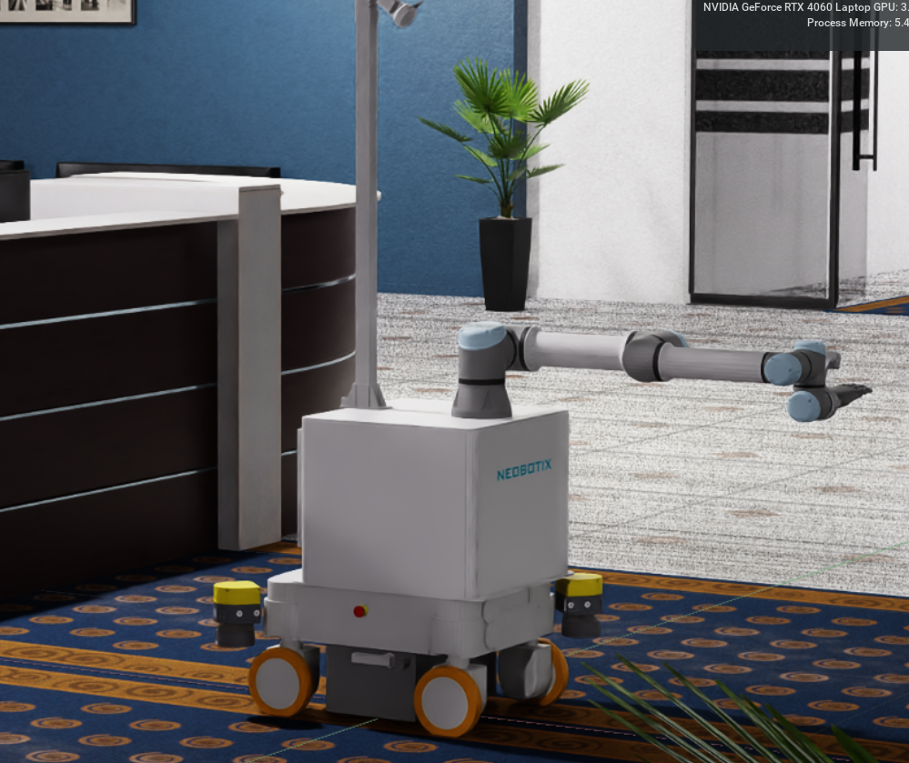

# HRL-Steve-IsaacSim
ROS2 enabled USD file of Steve robot for Isaac-Sim.



### Setup:
1. Follow [issac_sim_devcontainer](https://github.com/NDHANA94/isaac_sim_devcontainer.git) repository to setup the devcontainer for Isaac-Sim.

2. Open devcontainer in `vscode`

3. Clone this repository to `/workspace` directory in `devcontainer`.
    ```bash
    cd /workspace
    git clone https://github.com/NDHANA94/HRL-Steve-IsaacSim.git
    ```

4. Give display access to docker: 
    - Open the terminal and run following command in local PC
        ```bash
        xhost +local:docker
        ```

4. Launch `Isaac-Sim` in devcontainer:
    ```bash
    cd /isaac-sim
    ./isaac-sim.sh
    ```

5. Open Steve in Isaac-Sim:
    - `File -> Open -> My Computer -> workspace -> HRL-Steve_IsaacSim -> usd -> steveInOffice -> steveInOffice.usd`
    

### TODO

- [x] Wheel Command Subscriber.
- [x] Castor Command Subscriber.
- [x] UR5 Joint Command Subscriber.
- [x] Hand Command Subscriber.
- [x] Pan-Tilt Command Subscriber.
- [ ] Joint state Publisher (Implemented, but when subscribing an error occur. Error: ResponseError("unknown tag 'rclpy.type_hash.TypeHash'"))
- [ ] Odometry Publisher
- [ ] Camera Publisher
- [ ] Lidar Publisher
- [ ] ROS2 Controller package to control wheel velocity and castor joint for given twist command.


